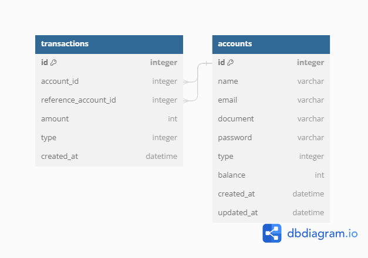
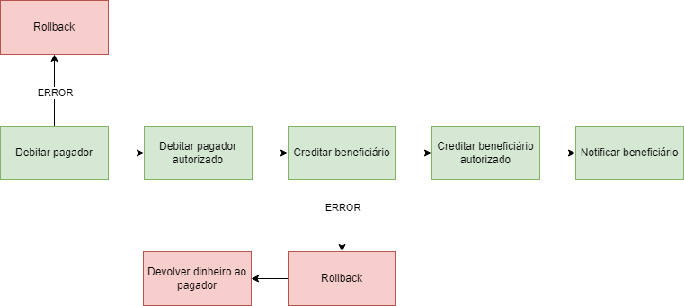

# Transferência Bancária

Este projeto tem a função de realizar uma transferência entre contas, gerando eventos dessas transações.

## Database



## Fluxo de Eventos


    
## Rodando localmente

Clone o projeto

```bash
  git clone https://link-para-o-projeto
```

Entre no diretório do projeto

```bash
  cd bank-transfer
```

Copie o arquivo .env.example

```bash
  cp .env.example .env
```

Inicie o servidor (com o banco de dados)

```bash
  docker-compose up
```

## Documentação da API

#### Cria uma conta bancária com um saldo inicial

```http
  POST /accounts
```

| Parâmetro   | Tipo       | Descrição                                                                           |
| :---------- | :--------- | :---------------------------------------------------------------------------------- |
| `name`      | `string`   | **Obrigatório**. O nome da pessoa física ou jurídica                                |
| `email`     | `string`   | **Obrigatório**. Email                                                              |
| `document`  | `string`   | **Obrigatório**. CPF/CNPJ                                                           |
| `password`  | `string`   | **Obrigatório**. Senha                                                              |
| `type`      | `integer`  | **Obrigatório**. Tipo da conta, sendo 1 para Pessoa Física e 2 para Pessoa Jurídica |
| `balance`   | `integer`  | **Obrigatório**. Seu saldo inicial. Deve ser maior que zero                         |

#### Cria uma transferência entre duas contas bancárias

```http
  POST /transactions
```

| Parâmetro   | Tipo       | Descrição                                                           |
| :---------- | :--------- | :------------------------------------------------------------------ |
| `payee`     | `string`   | **Obrigatório**. O ID do beneficiário                               |
| `payer`     | `string`   | **Obrigatório**. O ID do pagador                                    |
| `amount`    | `integer`  | **Obrigatório**. O valor a ser transferido. Deve ser maior que zero |

## Rodando os testes

Para rodar os testes, rode o seguinte comando

```bash
  docker-compose run php composer run-script test
```

Para rodar os testes com a cobertura de teste, rode o seguinte comando
Obs.: O dashboard da cobertura de teste ficará na pasta **runtime/coverage**

```bash
  docker-compose run php composer run-script test-coverage
```

Para rodar a ferramenta de análise estática

```bash
  docker run -it --rm -v "$(pwd):/project" -w /project jakzal/phpqa phpmd app text cleancode,codesize,controversial,design,naming,unusedcode
```

## Tecnologias utilizadas

PHP, Swoole e MySQL. O Hyperf é o framework utilizado no projeto
